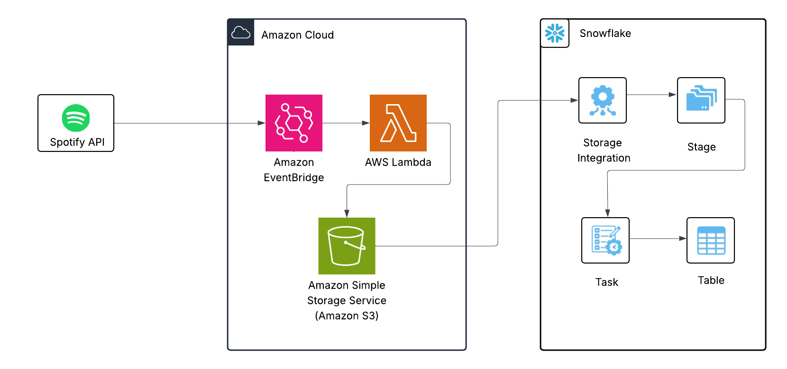

# Spotify Data Pipeline

This project fetches data from the Spotify API, loads the data into an S3 bucket using AWS Lambda, and then loads that data into Snowflake for further analysis. The pipeline is scheduled using EventBridge to run at regular intervals.

## Project Architecture

1. **Spotify API**: Data is fetched from the Spotify API.
2. **AWS Lambda**: AWS Lambda is used to fetch data from Spotify and store it in an S3 bucket.
3. **EventBridge**: EventBridge triggers the Lambda function at scheduled intervals.
4. **S3**: Data is stored as JSON files in an S3 bucket.
5. **Snowflake**: Snowflake is used as the target for data storage. The data is loaded into Snowflake via a Snowflake Storage Integration.

## 🗺️ Architecture Diagram

## Setup and Configuration

To get started, clone the repository and follow the setup steps:

### Prerequisites

- AWS account with permissions to create Lambda, S3, EventBridge, and other necessary resources.
- Snowflake account with permissions to create Storage Integrations, Stages, and Tables.
- Spotify Developer account to access the Spotify API.

### Steps

1. **Create an IAM Role** for Lambda with the necessary permissions (S3, EventBridge).
2. **Create an S3 bucket** to store the JSON data fetched from Spotify.
3. **Set up Lambda** to fetch data from Spotify and save it to S3.
4. **Create an EventBridge Rule** to trigger the Lambda function on a schedule.
5. **Set up Snowflake**:
   - Create a Storage Integration.
   - Create a Stage to access data in S3.
   - Use Snowflake Tasks to load the data into a table periodically.

### Running the Project

Once everything is set up, the pipeline will fetch data from Spotify at regular intervals and store it in Snowflake.

## Acknowledgments

- [Spotify Developer API](https://developer.spotify.com)
- [AWS Lambda](https://aws.amazon.com/lambda/)
- [Snowflake](https://www.snowflake.com/)
